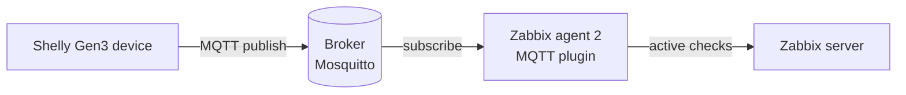

# CLAUDE.md

Guidance for Claude Code when working in this repository.

## What this repo is

A **Zabbix 7.4 template set** for monitoring **Shelly Gen3** devices over **MQTT**, published for reuse. Config + docs, not application code. Two templates:

- `shelly_gen3_common_by_mqtt.yaml` — **base** template `Shelly Gen3 common by MQTT`: device-agnostic topics (sys, wifi, cloud, mqtt, ws, online). Any Gen3 Shelly can link it.
- `shelly_pm_mini_gen3_by_mqtt.yaml` — `Shelly PM Mini Gen3 by MQTT`: meter-specific `pm1:0` items; **links the base** via a `templates:` block.
- `zabbix-7.4-template-reference.md` — a working reference for the Zabbix 7.4 template export/import schema, including gotchas verified against a live import. **Read this before editing the template YAML.**

Import order matters: the **base must be imported first** (the PM template references it by name). The two files share the `Templates/IoT` template-group UUID (`9702754414644deba5cb4ed3e9f33594`) intentionally — keep it identical in both.

## Architecture



- A Shelly Gen3 publishes JSON to per-component topics under `<root>/status/` (`pm1:0`, `sys`, `wifi`, `cloud`, `mqtt`, `ws`; `ble`/`bthome` are empty `{}`) plus the `<root>/online` LWT topic. On reboot it publishes them all at once; `wifi`/`cloud`/`mqtt`/`ws` are otherwise published on state CHANGE only. There is NO single combined status blob. (Correction: `status/wifi` — incl. `rssi` — IS published over MQTT; an earlier note wrongly said otherwise.)
- Zabbix **agent 2** with the built-in MQTT plugin subscribes (`mqtt.get`, active). Broker URL + credentials live in an agent **named session** (`Plugins.MQTT.Sessions.<name>.*`), NOT in the template.
- Items use a named session by reference: `mqtt.get[{$SHELLY.SESSION},{$SHELLY.TOPIC}/status/sys]`.

## Template design (do not regress these)

- **Master/dependent per topic.** One `ZABBIX_ACTIVE` master `mqtt.get` item per MQTT topic; all scalar metrics are `DEPENDENT` items parsing the master's JSON via `JSONPATH`. Each topic is subscribed once. `mqtt.get` subscribes to ONE topic per item, so masters are per-topic and cannot be merged across topics.
- **No hardcoded private data.** IP, MAC, device name, broker, SSID must never appear as macro defaults or examples. Device-specific values are per-host input: macro `value` empty + `REQUIRED` in the description. The template must stay generic and shareable.
- **Macros:** base has `{$SHELLY.SESSION}` (agent MQTT session name, default `shelly`), `{$SHELLY.TOPIC}` (FULL topic root, e.g. `shelly/<device-name>` — REQUIRED, empty default), `{$SHELLY.DATA.TIMEOUT}`, `{$SHELLY.RSSI.MIN}`. The PM template adds `{$SHELLY.POWER.MAX}`. A linked host inherits the base macros.
- **`{$SHELLY.TOPIC}` holds the FULL path** including the `shelly/` prefix. The agent session's `Topic` field is a *default only* — NOT prepended (verified from plugin source: `src/go/plugins/mqtt`). So item keys must carry the complete topic.
- **Boolean items** (`online`, `restart_required`, `cloud/mqtt/ws connected`): stored as `UNSIGNED`, converted with `BOOL_TO_DECIMAL`, displayed via value maps (`Shelly online` = Offline/Online, `Shelly boolean` = No/Yes — two maps kept intentionally for readable per-context wording). Value maps live in the BASE template.
- **`available_updates`** (firmware): JAVASCRIPT preprocessing returns 1 if the object is non-empty else 0 (JSONPath alone can't test object emptiness).
- **`nodata()` needs history.** Any item a `nodata()` trigger reads must have `history` > 0. The `sys` and `pm1:0` masters are set to `history: '1h'` for this reason (masters otherwise use `history: '0'`).
- **No `DISCARD_UNCHANGED_*`.** Considered and rejected: at home scale the history saved is negligible while it breaks `nodata()`, staleness of `last()`, and masks gaps.

## Zabbix 7.4 schema gotchas (learned from real import failures — see reference doc)

Editing the template YAML? These WILL bite if ignored:
- **UUIDs must be valid UUIDv4** (not just 32 hex): 13th hex digit `4`, 17th in `8/9/a/b`. Never hand-author — generate: `python3 -c "import uuid;print(uuid.uuid4().hex)"`. UUIDs must be unique ACROSS both files, EXCEPT the shared `Templates/IoT` group UUID which must be identical in both.
- **Triggers go at `zabbix_export` ROOT level**, NOT inside the template element.
- **Value maps go INSIDE the template as `valuemaps:`**, NOT root-level `value_maps:`.
- **Linked templates**: a child references its base via a `templates:` block inside the template element (`templates:\n  - name: 'Shelly Gen3 common by MQTT'`). Import the base first.
- The importer reports only the FIRST error, then stops — expect to iterate.
- No tabs; 2-space indent.

## Validate before delivering any YAML change

```python
import re
from collections import Counter
SHARED_GROUP = '9702754414644deba5cb4ed3e9f33594'  # Templates/IoT — intentionally shared
allu = []
for f in ['shelly_gen3_common_by_mqtt.yaml', 'shelly_pm_mini_gen3_by_mqtt.yaml']:
    txt = open(f).read()
    u = [x.lower() for x in re.findall(r'uuid:\s*([0-9a-f]{32})', txt)]
    assert all(x[12]=='4' and x[16] in '89ab' for x in u), f'{f}: uuid not valid v4'
    assert '\t' not in txt, f'{f}: tab present'
    assert not re.search(r'^  value_maps:', txt, re.M), f'{f}: value_maps at root'
    assert not re.search(r'^      triggers:', txt, re.M), f'{f}: triggers inside template'
    allu += u
dupes = {k for k, v in Counter(allu).items() if v > 1}
assert dupes <= {SHARED_GROUP}, f'unexpected cross-file dup uuids: {dupes}'
```
Local validation ≠ import success — a live 7.4 import is the only true schema check.

## Conventions

- Do not commit unless explicitly asked.
- Keep the reference doc (`zabbix-7.4-template-reference.md`) in sync when a new schema fact is learned from an import.
- Target platform: Zabbix **7.4**, Zabbix **agent 2** with MQTT plugin.
