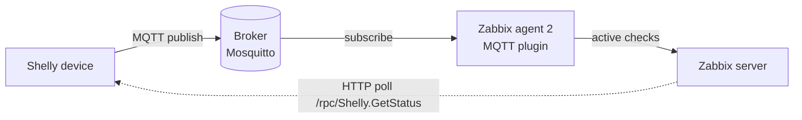

# zabbix-shelly

Zabbix 7.4 templates for monitoring **Shelly Gen2/Gen3** devices, over **MQTT** or **HTTP**.

Two transport families, each a reusable **common base** + thin **device templates**:

**MQTT** (Zabbix agent 2 MQTT plugin; device publishes to a broker — works across network segmentation):
- `Shelly Gen3 common by MQTT` — system/WiFi/cloud/MQTT/WebSocket/online.
- `Shelly PM Mini Gen3 by MQTT` — PM Mini energy meter (`pm1:0`); links the base.

**HTTP** (Zabbix HTTP agent polling `/rpc/Shelly.GetStatus`; needs server→device reachability; no MQTT required on the device):
- `Shelly Gen2/3 common by HTTP` — system/WiFi/cloud/MQTT/WebSocket.
- `Shelly Mini 1 Gen3 by HTTP` — non-metering relay (switch:0, input:0).
- `Shelly Plus 2PM by HTTP` — two metered switch channels (switch:0/1, **switch** profile).
- `Shelly Plus 2PM Cover by HTTP` — roller/blind motor (cover:0: state, position, power; **cover** profile).
- `Shelly Plug S Gen3 by HTTP` — metered smart plug (switch:0).
- `Shelly PM Mini Gen3 by HTTP` — energy meter (`pm1:0`).

Each device template links its common base. **Import the matching common base first.** The Plus 2PM has two firmware profiles — pick the template matching the device's profile: **switch** (two independent on/off channels) or **cover** (one ganged motor for a shutter/blind). Only one profile is active per device.

> Battery-powered Shellies (e.g. Flood, H&T, Door/Window) are **not** suited to HTTP polling — they sleep and only wake briefly, so HTTP requests usually time out. Monitor those over MQTT/push or cloud instead; these HTTP templates target mains-powered devices.

**Which to use?** MQTT if your devices publish to a broker (and especially if the Zabbix server cannot reach the device network directly). HTTP if the server/proxy can reach the device over TCP/80 and you prefer polling, or the device has no MQTT configured. For auto-onboarding new devices, see [NETWORK-DISCOVERY.md](NETWORK-DISCOVERY.md) (HTTP only).



## MQTT templates

One master `mqtt.get` item per topic + dependent items parsing JSON via JSONPath (each topic subscribed once).

**Common base** (`Shelly Gen3 common by MQTT`):

| Metric | Source topic |
|---|---|
| Uptime, restart-required, RAM free, firmware-update-available | `<root>/status/sys` |
| WiFi RSSI, SSID, IP, status | `<root>/status/wifi` |
| Cloud connected | `<root>/status/cloud` |
| MQTT connected | `<root>/status/mqtt` |
| WebSocket connected | `<root>/status/ws` |
| Online / availability | `<root>/online` (LWT) |

Triggers: offline, no-data, restarted, restart-required, weak WiFi; cloud-disconnected and firmware-update triggers ship **disabled** by default. Includes a system-health dashboard.

**PM meter** (`Shelly PM Mini Gen3 by MQTT`):

| Metric | Source topic |
|---|---|
| Active power, voltage, current, frequency, energy total, returned energy | `<root>/status/pm1:0` |

Trigger: high active power. Includes a power/voltage/energy dashboard.

> Note: `wifi`, `cloud`, `mqtt`, `ws` are published on state **change** / reboot (not periodically), so those items may be empty until the next change. `sys` and `pm1:0` are published periodically when the device's status notification is enabled.

## Requirements

- Zabbix server + frontend **7.4**
- Zabbix **agent 2** (with the built-in MQTT plugin) on a host that can reach your MQTT broker
- An MQTT broker (e.g. Mosquitto) the Shelly publishes to
- A Shelly PM Mini Gen3 with MQTT enabled

## Installation (MQTT)

### 1. Import the templates

Zabbix frontend → **Data collection → Templates → Import**. **Import the common base first**, then the meter template (the meter template links the base by name, so the base must exist):

1. `shelly_gen3_common_by_mqtt.yaml`
2. `shelly_pm_mini_gen3_by_mqtt.yaml`

### 2. Configure the Zabbix agent 2

The template's items are **active checks** that reference a named **MQTT session**, so the broker connection lives on the agent — not in Zabbix. On Debian the packaged agent uses a drop-in layout; the stock `/etc/zabbix/zabbix_agent2.conf` is left as-is (it already has `Include=/etc/zabbix/zabbix_agent2.d/*.conf` and `.../plugins.d/*.conf`), and you add two small files.

**a) Define the MQTT session** — `/etc/zabbix/zabbix_agent2.d/plugins.d/mqtt.conf`:

```ini
# Broker connection for the "shelly" session. Item keys reference it by name:
#   mqtt.get[shelly,<full-topic>]
Plugins.MQTT.Sessions.shelly.Url=tcp://broker.example.lan:1883

# Optional broker auth (leave commented for anonymous):
#Plugins.MQTT.Sessions.shelly.User=
#Plugins.MQTT.Sessions.shelly.Password=

# NOTE: do NOT set a session Topic. The MQTT plugin treats it as a default that is
# used ONLY when an item key omits the topic — it is NOT prepended to the item-key
# topic. This template always passes the full topic, so a session Topic does nothing.
#Plugins.MQTT.Sessions.shelly.Topic=
```

For TLS (broker on 8883) use `ssl://broker.example.lan:8883` and set the `TLSCAFile` / `TLSCertFile` / `TLSKeyFile` session options as needed.

**b) Bind the agent to the Shelly host name(s)** — `/etc/zabbix/zabbix_agent2.d/zabbix_agent2.conf`:

```ini
# Active checks bind by host NAME. List every Zabbix host this agent serves,
# comma-separated. Each name here MUST exactly match a Host name in Zabbix.
Hostname=<this-machine-name>,shelly-livingroom-pm

Server=<zabbix-server>
ServerActive=<zabbix-server>
```

Add more Shelly hosts by extending the `Hostname=` list, e.g. `Hostname=<this-machine>,shelly-livingroom-pm,shelly-kitchen-pm`, then restart the agent.

> `Server` (passive allow-list) is only needed for local `zabbix_get` testing or passive items — active checks use `ServerActive` only. On Debian, note the machine's own hostname often resolves to `127.0.1.1` (not `127.0.0.1`); if your server listens on `0.0.0.0:10051` this doesn't matter.

**c) Restart the agent:**

```bash
sudo systemctl restart zabbix-agent2
```

Verify the MQTT plugin is present:

```bash
zabbix_agent2 -p 2>/dev/null | grep -i mqtt
```

### 3. Create the host in Zabbix

- **Host name:** must exactly match the name you added to the agent `Hostname=` list (e.g. `shelly-livingroom-pm`).
- **Interfaces:** none — leave empty (all items are active).
- **Templates:** link `Shelly PM Mini Gen3 by MQTT` (it automatically pulls in `Shelly Gen3 common by MQTT`).
- **Host groups:** e.g. `Shellies`, `Shellies/Power Meters`.
- **Macros:**

  | Macro | Value | Notes |
  |---|---|---|
  | `{$SHELLY.SESSION}` | `shelly` | Must match the session name in `mqtt.conf`. Default is `shelly`. |
  | `{$SHELLY.TOPIC}` | `shelly/shelly-livingroom-pm` | **FULL** topic root = `<mqtt-prefix>/<device-name>`. Includes the `shelly/` prefix. No trailing slash. |
  | `{$SHELLY.POWER.MAX}` | `2000` | High-power trigger threshold (W). Optional. |
  | `{$SHELLY.DATA.TIMEOUT}` | `10m` | No-data → offline window. Optional. |
  | `{$SHELLY.RSSI.MIN}` | `-75` | Weak-WiFi trigger threshold (dBm). Optional. |
  | `{$SHELLY.MODEL}` | `S3PM-001PCEU16` | Device model/SKU, fed to host inventory. Override for other regional variants. Optional. |

  Find your topic root with: `mosquitto_sub -h broker.example.lan -t '#' -v`

### 4. Configure the Shelly device

In the device's MQTT settings: enable MQTT, point it at your broker, and enable **"Status notification"** (or set an RPC status notify period) so it publishes `pm1:0` periodically — not only on change.

### 5. (Optional) Enable host inventory

The templates auto-populate several Zabbix **host inventory** fields, but only if the host's inventory mode is set to **Automatic** — a per-host setting a template cannot force. To enable: **Data collection → Hosts → [host] → Inventory tab → select "Automatic"**. (When onboarding via network discovery, the discovery action can set this automatically with a "Set host inventory mode → Automatic" operation — see [NETWORK-DISCOVERY.md](NETWORK-DISCOVERY.md).)

Auto-filled fields once Automatic:

| Inventory field | Source |
|---|---|
| MAC address A | `sys.mac` (live) |
| Host networks | `wifi.sta_ip` (live) |
| Vendor | constant `Shelly` |
| Model | `{$SHELLY.MODEL}` macro |

If inventory mode stays Disabled/Manual, these links are silently ignored — nothing breaks, the values just won't flow into inventory. Values refresh at the item cadence (MAC/Vendor/Model discard-unchanged with a 1-day heartbeat).

## Installation (HTTP)

Use this path when the Zabbix server (or proxy) can reach the device over TCP/80. No MQTT or agent MQTT-session needed.

### 1. Import the templates

**Data collection → Templates → Import.** Import the HTTP common base first, then the device template(s):

1. `shelly_gen3_common_by_http.yaml`
2. one or more device templates: `shelly_mini_1_gen3_by_http.yaml`, `shelly_plus_2pm_by_http.yaml`, `shelly_plus_2pm_cover_by_http.yaml`, `shelly_plug_s_gen3_by_http.yaml`, `shelly_pm_mini_gen3_by_http.yaml`

### 2. Ensure reachability

The Zabbix server/proxy must reach the device on TCP/80. If the device is on an isolated IoT VLAN, open a rule allowing the server to reach that subnet on port 80. Verify from the server:

```bash
python3 -c "import urllib.request;print(urllib.request.urlopen('http://<device-ip>/rpc/Shelly.GetDeviceInfo',timeout=5).read())"
```

### 3. Create the host

- **Host name:** anything (HTTP items don't bind by name like active checks do).
- **Interfaces:** none required (HTTP agent items use the macro URL). Optionally add an agent interface if you want to reference its IP.
- **Templates:** link the device template (it pulls in `Shelly Gen2/3 common by HTTP`).
- **Macros:** set `{$SHELLY.HTTP.HOST}` to the device IP/hostname. If the device has auth enabled (`auth_en:true`), also set `{$SHELLY.HTTP.USER}` / `{$SHELLY.HTTP.PASSWORD}` and switch the master item's `authtype` to `DIGEST`.

Inventory auto-population (MAC/IP/Vendor/Model) works the same as MQTT — set the host Inventory mode to **Automatic**.

### Auto-onboarding

To auto-create hosts for new devices, see [NETWORK-DISCOVERY.md](NETWORK-DISCOVERY.md).

## Verify

**Monitoring → Latest data** for the host.
- **MQTT:** the master items (`PM1: Raw status`, `System: Raw status`) populate first; dependents derive from them. If empty: check the agent reaches the broker, `{$SHELLY.TOPIC}` matches the device's topic, and the host name matches the agent `Hostname=`.
- **HTTP:** the `Shelly: Raw status (GetStatus)` master populates first; all dependents derive from it. If empty: check the server reaches the device over HTTP and `{$SHELLY.HTTP.HOST}` is set.

## Other Shelly devices

For a Shelly not covered here, link the relevant **common base** (MQTT or HTTP) on its own for system/WiFi/cloud monitoring, and add a small device-specific template following the same master/dependent pattern for that device's own components (switch/cover/pm/em/etc.).

## Notes

- Target: Zabbix **7.4**. Other versions may need export-schema adjustments.
- `zabbix-7.4-template-reference.md` documents the template export/import schema and gotchas learned while building this template.

## License

MIT — see [LICENSE](LICENSE).
